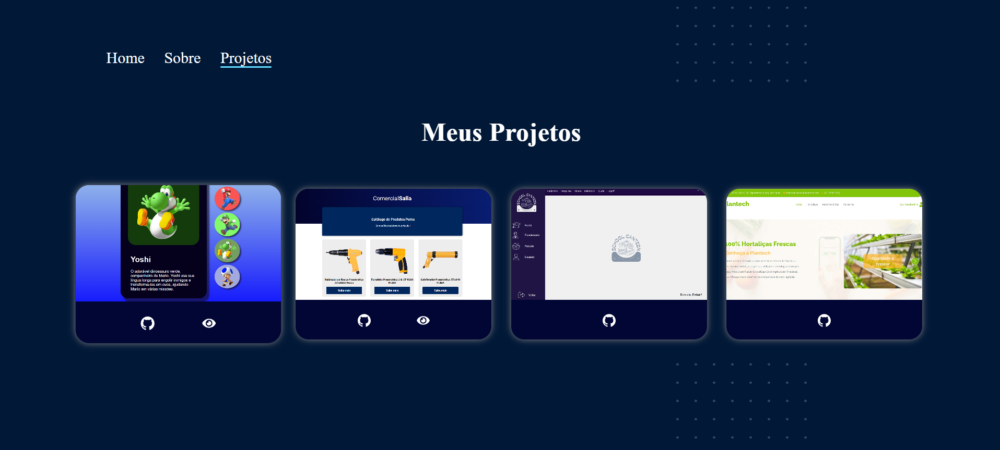

<h3>Bem-vindo(a) ao meu portfólio!</h3>

Como desenvolvedor front-end, decidi criar um portfólio para mostrar alguns dos meus projetos, tecnologias que domino e também falo um pouco sobre mim e minhas experiências. Todo o projeto foi feito utilizando as seguintes tecnologias:

- ReactJS
- Javascript
- CSS

Inicialmente criei a página home, com algumas informações sobre mim e links de acesso para as redes sociais:

  

 

Na pagina sobre, estão algumas informações sobre mim, e toda minha tragetória.

Já na página de projetos, deixei alguns dos projetos que desenvolvi durante meus estudos.

  

 

Cada projeto é apresentado em um card onde o usuário tem acesso as seguintes informações:
- Ao repositório do projeto no GitHub
- Acesso a aplicação em funcionamento, possibilitando que o usuário tenha uma experiência interativa com o projeto

<h4>Espero que tenha gostado :) </h4> 